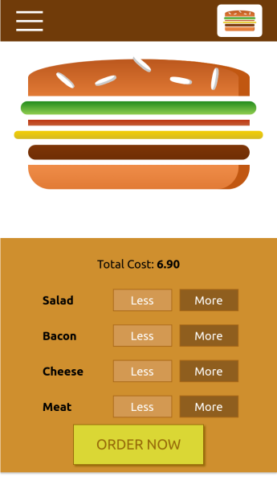

## Burger Builder App

This is a mobile first application for building and ordering a burger.

Bootstrapped with [Create React App](https://github.com/facebook/create-react-app).

Tech stack:

- React 16.8

- React DOM 16.8

- React Redux 7.1

- React Scripts 3.0

- PropTypes 15.7

- Axios 0.19

- Redux Thunk 2.3

- Enzyme 3.10

- Google Firebase

## Available Scripts

In the project directory, you can run:

### `npm start`

Runs the app in the development mode
Open [http://localhost:3000](http://localhost:3000) to view it in the browser.

The page will reload if you make edits
You will also see any lint errors in the console.

### `npm test`

Launches the test runner in the interactive watch mode. 
See the section about [running tests](https://facebook.github.io/create-react-app/docs/running-tests) for more information.

In case you get <System limit for number of file watchers reached> run the following
commands, which will temporarily increase the limit of inotify watchers:

sudo sysctl fs.inotify.max_user_watches=524288
sudo sysctl -p

## Implementation details

The application has a relatevely standard structure: it is split into a number of reusable web components, most
of which are stateless, and the application state is managed by shared store where components could exchange
data. The shared store is namespaced inside. Some components store local state as well.

The popular Redux library is used to store the application global state.

Axios is used for communication with Firabase server and for post/pre request/response processing.

Actions are dispatched to reducers via action creators concept: action creators are functions which are
used to dispatch actions and are used for encapsulation, abstraction and consistency.

Redux thunk library is used to provide async action creators functionality, without it otherwise the 
dispatched actions are processed synchronously

Higher order components are used to wrap some of the components, for example ErrorHandler is used to
provide error handling functionality, asyncComponent is used to load some modules asynchronously

### Components vs containers folders

Components folder contains stateless components
Containers folder contains stateful components
